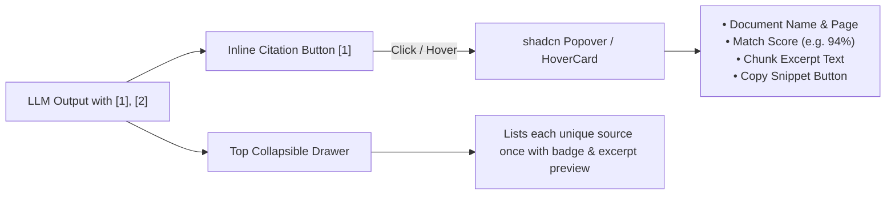

# FileSense UI — Comprehensive Design System & Component Specification

> **Version:** 2.0  
> **Tech Stack:** React 19, Vite, Tailwind CSS v4, shadcn/ui (`base-nova`), AI Elements (`elements.ai-sdk.dev`), Clerk Auth, Lucide Icons.

---

## 1. Design Philosophy & Visual Language

FileSense is an **AI-native document intelligence and RAG platform**. The interface is designed to feel:
- **Calm & Focused:** Ample whitespace, soft neutral warm tones, and deliberate typography to minimize cognitive fatigue during deep reading and multi-turn research.
- **Precision-Grounded:** Citations, vector match scores, and chunk excerpts are presented with crystal-clear provenance and non-intrusive interactive popovers.
- **Modular & Composable:** Standardized on **shadcn/ui** primitives and **AI Elements** (`elements.ai-sdk.dev`) patterns.

---

## 2. Design Tokens & Color Palette

### 2.1 Color System (Tailwind CSS v4 / CSS Variables)

| Token | Light Value | Purpose / Usage |
|---|---|---|
| **Background (App Canvas)** | `#FAF9F6` / `neutral-50` | Warm cream off-white background |
| **Surface (Card / Panels)** | `#FFFFFF` | Message cards, sidebars, modal popovers |
| **Sidebar / Sub-surface** | `#F8F7F3` | Navigation sidebar and secondary containers |
| **Primary (Brand / Actions)**| `#7C5CFC` / `#5229EC` | Active buttons, focus rings, primary badges |
| **Primary Accent Soft** | `#E2DAFF` | Soft badge backgrounds, icon container chips |
| **Foreground (Text)** | `#161613` | Deep obsidian high-contrast body text |
| **Muted Text** | `#16161380` / `#16161366` | Secondary metadata, timestamps, subheaders |
| **Border / Dividers** | `#16161312` / `border` | Subtle hairline borders (`1px solid`) |
| **Success / Grounding** | `#136C40` / `#D8F3E5` | Processed status, high vector match scores (≥80%) |
| **Warning / Processing** | `#B88700` / `#FFF0B3` | Indexing in-progress, medium match scores |
| **Destructive / Error** | `#C53030` / `#FFF0ED` | Deletion actions, upload/vector errors |

### 2.2 Typography Scale

- **Sans / UI Font:** Geist Sans / Inter (`font-sans`) — Used for all UI controls, body text, buttons, and inputs.
- **Headings / Serif Font:** Geist Sans / Georgia / Newsreader (`font-serif`) — Used for document titles, modal headers, and markdown H1–H3.
- **Monospace Font:** Geist Mono / JetBrains Mono (`font-mono`) — Used for citation numbers (`[1]`), mime types, match scores, file sizes, and timestamps.

### 2.3 Radii & Elevation Hierarchy

- **Small elements (Badges, Citation Pills):** `rounded-md` (`6px`) or `rounded-full` (`9999px`)
- **Interactive inputs / Buttons:** `rounded-xl` (`12px`) or `rounded-full`
- **Cards & Chat Bubbles:** `rounded-2xl` (`16px`) to `rounded-3xl` (`24px`)
- **Modals / Sheets / Drawers:** `rounded-3xl` (`24px`)
- **Shadows:** Minimal soft ambient shadows (`shadow-xs`, `shadow-sm`, `shadow-md`). Avoid harsh black drop shadows.

---

## 3. Component Architecture & Mapping

```mermaid
graph TD
    App[App.tsx - Core State & Layout] --> Sidebar[AppSidebar.tsx (shadcn)]
    App --> Header[AppHeader.tsx (shadcn Breadcrumb)]
    App --> Chat[ChatView.tsx (AI Elements)]
    App --> Artifacts[ArtifactsPanel.tsx (shadcn Sheet/Card)]

    Chat --> PromptInput[PromptInput (AI Elements)]
    Chat --> Messages[MessageList / MessageItem]
    Messages --> SourcesComponent[Sources & Source Items (AI Elements)]
    Messages --> Markdown[ChatMarkdown (react-markdown + GFM)]
    Messages --> CitationPopover[Inline Citation Popover (shadcn Popover)]
    Messages --> Actions[MessageActions (Copy, Feedback)]
```

### Component Migration Map (Legacy Swiss UI ➔ Modern Standard)

| Legacy Custom Component | Modern Replacement (shadcn / AI Elements) | Notes |
|---|---|---|
| `SwissButton.tsx` | `@/components/ui/button.tsx` | Variants: `default`, `secondary`, `outline`, `ghost`, `destructive` |
| `SwissModal.tsx` | `@/components/ui/dialog.tsx` / `@/components/ui/popover.tsx` | Accessible dialogs with focus trapping and backdrop blur |
| `SwissInput.tsx` | `@/components/ui/input.tsx` & `@/components/ui/textarea.tsx` | Standardized styled inputs with focus rings |
| `SwissBadge.tsx` | `@/components/ui/badge.tsx` | Badges for status, file types, match %, citation chips |
| `SwissSkeleton.tsx` | `@/components/ui/skeleton.tsx` | Shimmer placeholders for chat history and document lists |
| `SourceChips.tsx` (Modal) | `@/components/ai-elements/sources.tsx` + `Popover` | Non-intrusive inline citation popovers + collapsible source tray |
| Custom `ChatInput.tsx` | `@/components/ai-elements/prompt-input.tsx` | Integrated textarea, file dropzone & progress bar |

---

## 4. Detailed Component Specifications

### 4.1 AI Elements: `PromptInput`

The prompt input is pinned at the bottom of the conversation viewport.

- **Structure:**
  ```tsx
  <PromptInput className="rounded-3xl border bg-white shadow-sm p-2">
    <PromptInputTextarea
      placeholder="Ask anything about your project documents..."
      minRows={1}
      maxRows={6}
    />
    <PromptInputAttachmentList>
      {/* Uploaded / in-progress file pills */}
    </PromptInputAttachmentList>
    <PromptInputActions className="flex items-center justify-between">
      <PromptInputActionButtons>
        <FileUploadTrigger accept=".pdf,.txt,.md,.docx,.csv,.json" />
      </PromptInputActionButtons>
      <PromptInputSubmit loading={isStreaming} onStop={handleStop} />
    </PromptInputActions>
  </PromptInput>
  ```
- **Behavior & States:**
  - **Auto-expansion:** Smoothly expands up to 6 lines (180px) before scrolling.
  - **Direct Tigris S3 Upload:** Dropping a file triggers presigned URL initialization and live progress bar inside the input bar.
  - **Keyboard Shortcut:** `Enter` submits query, `Shift + Enter` inserts a newline.
  - **Streaming State:** Replaces Submit button with a square Stop generation button.

---

### 4.2 AI Elements: `Message` & Response Card

- **User Message:**
  - Compact obsidian dark pill (`bg-[#161613] text-white`) aligned to the right.
  - Generous padding (`px-5 py-3 rounded-2xl rounded-tr-xs text-sm`).
- **Assistant Message:**
  - Soft white container (`bg-white rounded-3xl border border-[#16161310] p-6 shadow-xs`).
  - Contains **3 sub-sections**:
    1. **Top Sources Tray:** (Collapsible `<Sources>` component).
    2. **Synthesized Markdown Content:** Headings, paragraphs, code blocks, and inline citation pills.
    3. **Bottom Action Bar:** Grounding badge, token generation timestamp, copy answer button.

---

### 4.3 Citation Architecture & Grounding UX

To prevent repetitive source text excerpts while maintaining rigorous attribution:



#### 1. Inline Citation Buttons
- Formatted as `[1]`, `[2]` in `font-mono text-xs font-semibold text-[#7C5CFC]`.
- Clicking opens a **shadcn Popover / HoverCard** attached to the clicked badge:
  - **Header:** Document name, page number (`Page 4–5`), match score badge (`94% match`).
  - **Body:** The exact chunk text excerpt with quotation styling.
  - **Footer:** "Copy Excerpt" button and "View Document" link.

#### 2. Collapsible `<Sources>` Component (Top of Assistant Card)
- Shows total unique sources count (e.g. `📚 3 Sources consulted`).
- Expandable accordion displaying individual source cards:
  - Deduplicated by document ID / chunk index.
  - Compact horizontally scrolling list or vertical accordion list.

---

### 4.4 Document Drawer (`ArtifactsPanel`) & Inspector

- **Artifacts Drawer (`src/components/documents/ArtifactsPanel.tsx`):**
  - Uses a collapsible side drawer (`w-80`) with transition ease.
  - Header with total document count and quick upload button.
  - Document Cards:
    - Dynamic filetype icons (PDF, Code, Spreadsheet, Schema, Image).
    - Status badges: `Processed` (green), `Processing` (yellow pulse), `Error` (red).
    - Quick actions: Inspect (Eye icon), Delete (Trash icon).
- **Document Inspector (`src/components/documents/DocumentInspector.tsx`):**
  - Uses shadcn `Dialog`.
  - Displays chunk count, file size (formatted in KB/MB), MIME type, Tigris storage path, and timestamps.

---

## 5. Streaming Architecture (Simplified Direct State)

### Removal of RAF Batching
The previous `requestAnimationFrame` token buffer in `ChatView.tsx` is replaced with standard React 19 functional state updates:

```typescript
// Stream Handler in ChatView
await submitQueryStream({
  question,
  projectId: activeProject.id,
  sessionId,
  history,
  signal: controller.signal,
  onSources: (incomingSources) => {
    setMessages((prev) =>
      prev.map((msg) =>
        msg.id === currentId ? { ...msg, sources: incomingSources } : msg
      )
    );
  },
  onToken: (chunk) => {
    setMessages((prev) =>
      prev.map((msg) =>
        msg.id === currentId
          ? { ...msg, answer: (msg.answer || "") + chunk, streaming: true, loading: false }
          : msg
      )
    );
  },
  onDone: (result) => {
    setMessages((prev) =>
      prev.map((msg) =>
        msg.id === currentId ? { ...msg, streaming: false, loading: false } : msg
      )
    );
  },
});
```

---

## 6. Directory Structure & File Layout

```
src/
├── api/                   # API clients & REST/SSE services
│   ├── client.ts          # Axios with Clerk JWT interceptor
│   ├── config.ts          # Base URL configuration
│   ├── documents.ts       # Document management API
│   ├── health.ts          # System health check
│   ├── projects.ts        # Projects CRUD
│   ├── queries.ts         # Queries & SSE stream client
│   └── upload.ts          # 2-step Tigris S3 direct upload
├── components/
│   ├── ai-elements/       # AI Elements (elements.ai-sdk.dev)
│   │   ├── conversation.tsx
│   │   ├── message.tsx
│   │   ├── prompt-input.tsx
│   │   ├── sources.tsx
│   │   └── code-block.tsx
│   ├── ui/                # shadcn/ui base primitives
│   │   ├── button.tsx
│   │   ├── dialog.tsx
│   │   ├── popover.tsx
│   │   ├── badge.tsx
│   │   ├── card.tsx
│   │   ├── skeleton.tsx
│   │   ├── scroll-area.tsx
│   │   ├── tooltip.tsx
│   │   └── dropdown-menu.tsx
│   ├── chat/              # Chat application views
│   │   ├── ChatView.tsx
│   │   ├── ChatMarkdown.tsx
│   │   └── NewProjectModal.tsx
│   ├── documents/         # Document panels
│   │   ├── ArtifactsPanel.tsx
│   │   └── DocumentInspector.tsx
│   ├── layout/            # Shell layout
│   │   ├── AppHeader.tsx
│   │   └── AppSidebar.tsx
│   └── landing/           # Unauthenticated landing page
│       └── LandingPage.tsx
├── lib/
│   └── utils.ts           # clsx + twMerge helper (cn)
├── types/
│   └── index.ts           # TypeScript interfaces
├── App.tsx                # App root
└── main.tsx               # Entry point
```

---

## 7. Implementation Checklist

- [ ] **Step 1:** Add necessary shadcn/ui components (`popover`, `dialog`, `badge`, `skeleton`, `scroll-area`, `tooltip`, `dropdown-menu`, `card`).
- [ ] **Step 2:** Implement AI Elements (`prompt-input`, `message`, `sources`, `code-block`).
- [ ] **Step 3:** Refactor `ChatView.tsx` to remove RAF token batching and utilize the new AI Elements.
- [ ] **Step 4:** Integrate Popover-based inline citations (`[1]`, `[2]`) in `ChatMarkdown.tsx`.
- [ ] **Step 5:** Modernize `AppSidebar.tsx` and `ArtifactsPanel.tsx` using shadcn primitives.
- [ ] **Step 6:** Remove legacy Swiss component wrappers (`SwissButton`, `SwissModal`, etc.).
- [ ] **Step 7:** Verify responsive design, dark-mode compatibility, and streaming stability.
